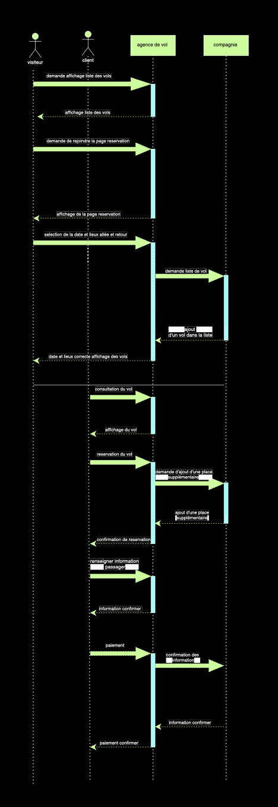
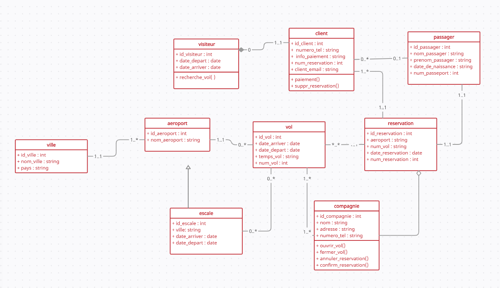

# Brief Kékés Voyages :airplane:

## Contexte du projet

> Notre client, une agence de voyages, souhaite proposer la possibilité de réserver en ligne des billets d'avion à leurs clients.

### Mission :

Concevoir à l'aide du standard UML la modélisation de la plateforme.

La plateforme devra permettre que :

- Un vol est ouvert à la réservation et refermé sur ordre de la compagnie.
- Un vol peut être annulé par la compagnie
- Un client peut réserver un ou plusieurs vols, pour des passagers différents.
- Une réservation concerne un seul vol et un seul passager.
- Une réservation peut être annulée ou confirmée.
- Un vol a un aéroport de départ et un aéroport d’arrivée.
- Un vol a un jour et une heure de départ, et un jour et une heure d’arrivée.
- Un vol peut comporter des escales dans des aéroports.
- Une escale a une heure d’arrivée et une heure de départ.
- Chaque aéroport dessert une ou plusieurs villes.
- Des compagnies aériennes proposent différents vols.

## Livrables

- [x] Un MCD
- [x] Un MLD
- [x] Un MPD

- [x] Un dictionnaire de données
- [x] Des règles de gestion
- [x] Un diagramme de cas d'utilisation
- [x] Un diagramme de classe
- [x] Un diagramme de Séquence

## Règle de gestion

#### Vol :

- Peut être réserver ou non par une compagnie.
- Il peut comporter des escales.
- Une compagnie peut annuler un vol.
- Contient un aéroport de départ, une date et une heure.
- Contient un aéroport d'arrivée, une date et une heure.
- Est un trajet d'un aéroport à un autre.
- Contient un numéro de vol.

#### Client :

- Peut réserver un ou plusieurs vols.
- Peut réserver pour une autre personne.

#### Aéroport :

- Peut desservir une ou plusieurs villes.
- Se situe dans une ville.

#### Ville :

- Peut avoir plusieurs aéroports.
- Se trouve dans un pays.
- Contient un nom.

#### Escale :

- Contient une heure d'arrivée .
- Contient une heure de départ.
- Un aéroport de départ.
- Un aéroport d'arriver.

#### Réservation :

- Une compagnie peut confirmer la réservation.
- Un client peut annulé une réservation.

#### Compagnie :

- Proposent plusieurs vols.
- Chaque compagnie propose s'est propre vol.
- Contient un nom.

## Dictionnaire de données

| Nom               | Signification                       | Type |
| :---------------- | :---------------------------------- | :--- |
| numero_tel        | Numéro de téléphone du client       | AN   |
| info_paiement     | Information de paiement du client   | AN   |
| num_revervation   | Numéro de réservation               | AN   |
| client_email      | Adresse email du client             | AN   |
| nom_passager      | Nom du passager                     | A    |
| prenom_passager   | Prénom du passager                  | A    |
| date_de_naissance | Date de naissance du passager       | Date |
| num_passeport     | Numéro de passeport du passager     | AN   |
| num_vol           | Numéro de vol                       | AN   |
| date_reservation  | Date de réservation                 | Date |
| nom               | Nom de compagnie                    | AN   |
| adresse           | Adresse de compagnie                | AN   |
| numero_tel        | Numéro de téléphone de la compagnie | AN   |
| date_arriver      | Date d'arrivée du vol               | Date |
| date_depart       | Date de départ du vol               | Date |
| nom_ville         | Nom de la ville                     | A    |
| pays              | Nom du pays                         | A    |
| nom_aeroport      | Nom de l'aéroport                   | A    |

### Diagramme UML :

Use case

Diagramme de Séquence

Diagramme de classe

### Diagramme MERISE :

MCD

MLD

MPD

## Contributeur

[:bust_in_silhouette: @Kyllian](https://github.com/kyllianbou)
[:bust_in_silhouette: @Josué](https://github.com/Rowada)

## Ressources

- [uml-diagrams.org](https://www.uml-diagrams.org/uml-25-diagrams.html)
- [devdesignbook.tiankod.fr](https://www.devdesignbook.tiankod.fr/)
- [diagrams.net](https://app.diagrams.net/)
- [creately.com](https://creately.com/fr/home/)
- [Looping](https://www.looping-mcd.fr/)
